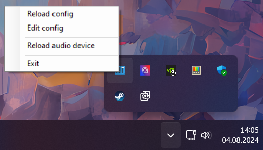

# Arduino-Based Volume Mixer Controller

## Overview

This application allows you to control the volume of various applications on your computer using an Arduino and potentiometers. By adjusting the potentiometers, you can easily control the volume levels of specified applications or system sounds like master volume and microphone volume.
Components


## 3D-Printed case

A custom 3D-printed case for the Arduino Pro Micro enhances both aesthetics and functionality, providing easy access to potentiometers and secure mounting for components. The project utilizes:

-   4x M2x6 screws
-   6x M3x8 screws
-   6x M3 brass inserts (length: 4mm, diameter: 4.5mm)

## Schematic


## Configuration

The configuration file (config.yaml) specifies the settings for your COM port, baud rate, and the applications you want to control. Here's a sample configuration:

#### Special Controls

-   master: Controls the overall system volume.
-   mic: Controls the microphone volume.
-   activeWindow: Controls currently focused app.

#### Application Grouping

By grouping applications together, you can control the volume of multiple applications simultaneously.

### Example Config:

```yaml
# How to edit the config:

# port:
#AUTO - automaticly detects port (Experimental feature)
#manual - Check your COM port in Device Manager (It should look like this -> port: COMx)
port: AUTO

# baudrate: Same Baud Rate as the one in arduinoCode.ino
baudrate: 57600

# invertSliders: Explains itself
invertSliders: false

# apps: List your apps here
#       Check the application name in Task Manager -> Details
#       App names are not case sensitive
#       Special controls: master - controls master volume
#                         mic - controls your microphone volume
#                         activeWindow - controls currently focused window volume
#       group: Group multiple apps together
apps:
    - master
    - firefox
    - activeWindow
    - Discord
    - group:
          - PathOfExileSteam
          - cs2
          - GeometryDash
          - RustClient
```

## Installation

Download `setup.exe` or `Mixer.Software.msi` and install the program.

## Usage

Connect the Arduino to your computer and upload the provided sketch.

Configure the application using the provided config.yaml file, ensuring the COM port and baud rate match those in the Arduino sketch.

Run the application on your computer. It will read the potentiometer values from the Arduino and adjust the specified application volumes accordingly.

If you got any error while opening Serial Port make sure you have correct config options and press `Reload config` in menu


